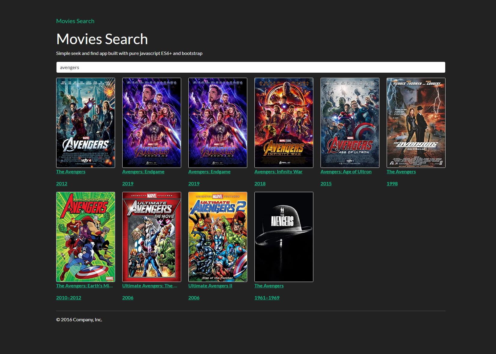

# Movie Search App 🎦🍿

Client side multi page app to fetch and display searched movies!

## Perquisites

* [VS Code](https://code.visualstudio.com/) with [live server](https://marketplace.visualstudio.com/items?itemName=ritwickdey.LiveServer) extension

## How to start

* Open the app folder then run live server

## Technologies 

* JavaScript
* [Fetch API](https://developer.mozilla.org/en-US/docs/Web/API/Fetch_API)
* [Window location](https://developer.mozilla.org/en-US/docs/Web/API/Window/location)
* [DOM Manipulation](https://developer.mozilla.org/en-US/docs/Learn/JavaScript/Client-side_web_APIs/Manipulating_documents)
* [OMDb API](http://www.omdbapi.com/)